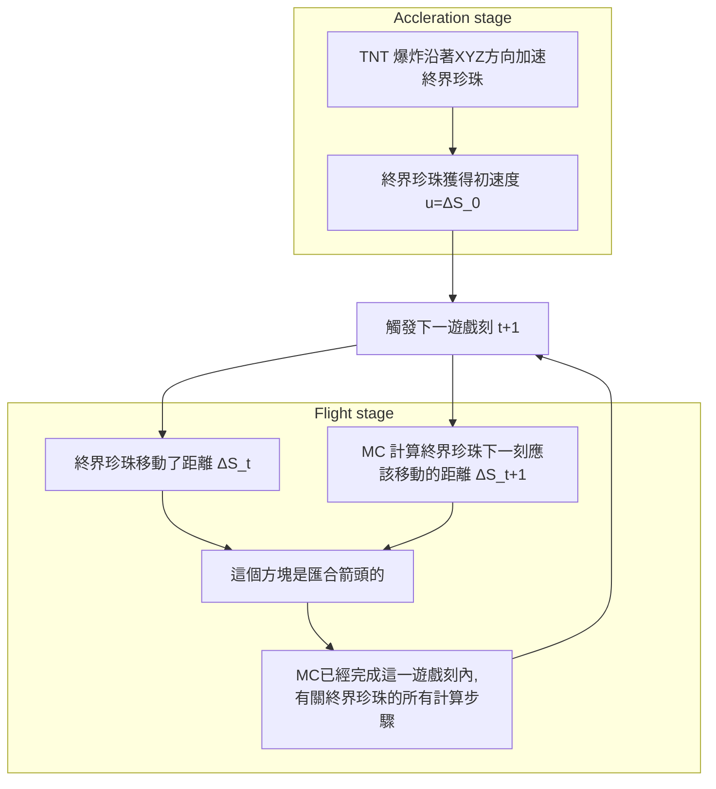

---

title: 終界珍珠軌跡
description: 終界珍珠軌跡公式的解
date: 2020-09-13

---

# 終界珍珠軌跡公式

## 目標

- 已知初速度向量，應用數學模型，以推導其拋射軌跡公式

## 定義

### 差動位移的定義

差動位移向量 $\Delta \vec{S_t}$ 決定 其拋射物下一遊戲刻之移動距離。
$$
\Delta \vec{S_t} = 

\begin{pmatrix}
\Delta x_t \\
\Delta y_t \\
\Delta z_t \\

\end{pmatrix}
$$
而$\Delta \vec{S_t} $的分量如下

- $\Delta x_t$ : 沿著 X 軸方向的分量
- $\Delta y_t$ : 沿著 X 軸方向的分量
- $\Delta z_t$ : 沿著 X 軸方向的分量

### 初速度的定義

初速度 **向量** $\vec{u}$ （通常由TNT爆炸給予）為下
$$
\vec{u} = 

\begin{pmatrix}
\Delta x_0 \\
\Delta y_0 \\
\Delta z_0 \\

\end{pmatrix}
$$
而 $\vec{u}$ 的分量如下

- $u_x = \Delta x_0$ : 沿著 X 軸方向的分量
- $u_y = \Delta y_0$ : 沿著 Y 軸方向的分量
- $u_z = \Delta z_0$ : 沿著 Z 軸方向的分量

留意 $\vec{u}$ （有時候寫作 **u**）只是用來描述 初速度，即 $\Delta \vec{S_0} = \vec{u}$

### 終界珍珠的物理機制

初速度標作  $\vec{u}$，而其絕對值為  $\lvert\vec{u}\rvert = \sqrt{\Delta x_0^2 + \Delta y_0^2 + \Delta z_0^2}$。以下的下劃線`_`寫法指作下標，例如 ΔS_0 指 $\Delta S_0$。

### 終界珍珠的差動位移

終界珍珠的差動位移由以下三個公式定義，這是已知事實。
(來源: [Xcom6000](https://youtu.be/Wc1E1zR40gw))
$$
\begin{align}
\Delta X_{t+1} &= 0.99 \Delta X_t\\
\Delta Y_{t+1} &= 0.99 \Delta Y_t - 0.03\\
\Delta Z_{t+1} &= 0.99 \Delta Z_t\\
\end{align}
$$
而 **終界珍珠的阻力** 是 0.99 ，-0.03是 「**地心引力**」。

如果要跳過加載終界珍珠拋射軌跡經過的所有區塊，終界珍珠的速度 $\lvert\vec{\Delta S_t}\rvert$ 最少要大於 320米每秒，或 16 格每遊戲刻。

## 推導

### 拋射軌跡

拋射軌跡是 終界珍珠受 TNT衝擊而飛行時，其高度對水平距離所形成的曲線。

這是所有差動位移的總和 $\vec{S}(t)$。
$$
\begin{align}
\vec{S}(t) &= \sum_{\tau=0}^t \Delta \vec{S_{\tau}} \\
S_x(t) &= \sum_{\tau=0}^t \Delta x_\tau  \\
S_y(t) &= \sum_{\tau=0}^t \Delta y_\tau  \\
S_z(t) &= \sum_{\tau=0}^t \Delta z_\tau  \\
\end{align}
$$
#### X-Z 軸方向

推導 X-Z 方向的過程是比較簡單的，因為這只是 0.99 的次方。

##### 符號

1. $u_x$ : 沿著 X 軸方向的初速度分量
2. $u_z$ : 沿著 Z 軸方向的初速度分量

##### 推導過程

以下引 X 軸方向 為例，和 Z 軸方向的求導方法相同。以下 $\Delta x$ 指 X 軸方向的差動位移。
$$
\begin{align}
\Delta x_{0} &= u_x\\
\Delta x_{1} &= 0.99 u_x\\
\Delta x_{2} &= 0.99 (\Delta x_{1})\\
\Delta x_{3} &= 0.99 (\Delta x_{2})\\
\Delta x_{k} &= 0.99^k u_x
\end{align}
$$
那麽，其總和就是拋射軌跡的 X 軸方向分量，對於時間 $t$ 的函數 $S_x(t)$。
$$
\begin{align}
S_x(t) &= \sum_{k=0}^t \Delta x_k\\
	&= u_x\sum_{k=0}^t 0.99^k\\
	&= u_x(\frac{1-0.99^t}{1-0.99}) &\quad\quad\text{幾何數列的總和}\\
	&= 100u_x(1-0.99^t)
\end{align}
$$
假設飛行高度不變（$\Delta y_t$ = 0），若 t 趨向無限（$t\to\infty$），飛行距離則為：
$$
\begin{align}
\lim_{t\to\infty}S_x(t) &= \lim_{t\to\infty}\sum_{k=0}^t \Delta x_k\\
	&= \lim_{t\to\infty}u_x\sum_{k=0}^t 0.99^k\\
	&= u_x \frac{1}{1-0.99}\\
	&= 100u_x
\end{align}
$$
Z 軸方向的求導方法相同。

#### Y 軸方向

##### 符號

1. $u_y$：沿著 Y 軸方向的初速度分量
2. 地心引力 = -0.03

##### 推導過程

###### 第 n 遊戲刻的差動位移公式

計算 Y 軸方向的差動位移公式需同時考慮 **終界珍珠的阻力** 和 **地心引力**。因此需要更多步驟來處理。
$$
\begin{align}
\Delta y_{0} &= u_y\\
\Delta y_{1} &= 0.99 u_y - 0.03\\
\Delta y_{2} &= 0.99 (\Delta y_{1}) - 0.03\\
\Delta y_{3} &= 0.99 (\Delta y_{2}) - 0.03\\
\vdots
\end{align}
$$
化簡以上，
$$
\begin{align}
x_1 &= ax + b	&\text{對於符號 $a,b,x_t$}\\
x_2 &= ax_1 + b\\
	&= a(ax + b) + b\\
	&= a^2x+ ab + b \\
x_3	&= ax_2 + b\\
	&= a(a^2x+ ab + b) + b\\
	&= a^3x+a^2b+ab+b\\
\\
\text{證明 $P(n): x_n$}&= a^nx+b(\frac{1-a^{n}}{1-a})\\ \\
P(1) : x_1=ax+b&=a^1x+b(\frac{1-a}{1-a}) &\text{參考 「數學歸納法」}\\
&=ax+b\\
&\therefore\text{$P(1)$ 成立。}\\\\

P(k) 			&= a^kx+b(\frac{1-a^{k}}{1-a})
&\text{證明 $P(k) \to P(k+1)$}\\
aP(k)+b 		&= a(a^kx+b(\frac{1-a^{k}}{1-a})) + b\\
				&=a^{k+1}x+b(\frac{a-a^{k+1}+1-a}{1-a})\\
				&=a^{k+1}x+b(\frac{1-a^{k+1}}{1-a})\\
				&=P(k+1)\\
&\therefore\text{$P(k) \to P(k+1)$ 成立。}\\\\

&\therefore\text{$x_n \equiv a^nx+b(\frac{1-a^{n}}{1-a})$}\\
\end{align}
$$
代入 $a=0.99,b=-0.03$.
$$
\begin{align}
\Delta y_{t} &= 0.99^tu_y-0.03(\frac{1-0.99^t}{1-0.99})\\
\Delta y_{t} &= 0.99^tu_y-3(1-0.99^t)\\
\Delta y_{t} &= 0.99^t(u_y+3)-3
\end{align}
$$

###### Y 軸方向的軌跡公式

$$
\begin{align}
S_y(t) &= 	\sum_{\tau=0}^t \Delta y_{\tau} \\
	&=	\sum_{\tau=0}^t 0.99^\tau(u_y+3)-3\\
	&=	(u_y+3)(\frac{1-0.99^t}{1-0.99})-3t\\
	&=	100(u_y+3)(1-0.99^t)-3t\\
\end{align}
$$

## 繪畫軌跡曲線

我們已經推導了對每一分量的軌跡公式。$L_{xz}(t)$ 是在X-Z平面移動的總距離。
$$
\begin{align}
S_x(t) = x(t)	&=	100u_x(1-0.99^t)\\
S_y(t) = y(t)	&=	100(u_y+3)(1-0.99^t)-3t\\
S_z(t) = z(t)	&=	100u_z(1-0.99^t)\\
L_{xz}(t)		&=	\sqrt{S_x^2(t) + S_z^2(t)}\\
				&=	\sqrt{x^2(t) + z^2(t)}\\
				&=	100(1-0.99^t)\sqrt{u_x^2 + u_z^2}
\end{align}
$$

### X-Y 面

我們須先推導 $x(t)$ 的逆函數來繪畫 $y(x)$。
$$
\begin{align}
x(t) &= 100u_x(1-0.99^t)\\
\frac{x(t)}{100u_x} &= 1-0.99^t\\
0.99^t &= 1-\frac{x(t)}{100u_x}\\
t(x) &= \log_{0.99}{(1-\frac{x}{100u_x})} &\text{$x(t)$ 逆函數}\\
\end{align}
$$
將  $t(x)$ 代入 $t$ 來計算 $y(t)$，
$$
\begin{align}
y(t)	&=	100(u_y+3)(1-0.99^t)-3t\\
y(t(x)) 	&=	100(u_y+3)(1-0.99^{t(x)})-3t(x)
\end{align}
$$
代入  $t(x) = \log_{0.99}{(1-\frac{x}{100u_x})}$，
$$
\begin{align}
y(t(x)) 	&=	100(u_y+3)(1-0.99^{t(x)})-3t(x)\\
y(x) 	&=	100(u_y+3)(1-0.99^{\frac{\log(1-\frac{x}{100u_x})}{\log(99)-2}})-3\frac{\log(1-\frac{x}{100u_x})}{\log(99)-2}\\
\end{align}
$$

### $L_{xz}$-Y 面

推導方法和求得 X-Y 面的方法相似，唯一相異為考慮 $L_{xz}(t)$ 而非 $x(t)$。
$$
\begin{align}
L_{xz}(t)	&=	100(1-0.99^t)\sqrt{u_x^2 + u_z^2}			\\
\frac{L_{xz}(t)}{100\sqrt{u_x^2 + u_z^2}}	&=	1-0.99^t		\\
0.99^t		&=	1-\frac{L_{xz}(t)}{100\sqrt{u_x^2 + u_z^2}}	\\
t(L_{xz}) 	&= \log_{0.99}{(1-\frac{L_{xz}}{100\sqrt{u_x^2 + u_z^2}})} &\text{$L_{xz}(t)$的逆函數}\\
\end{align}
$$
把 $t= t(L_{xz})$ 代入 $y(t)$。
$$
\begin{align}
y(t)	&=	100(u_y+3)(1-0.99^t)-3t\\
y(t(L_{xz})) 	&=	100(u_y+3)(1-0.99^{t(L_{xz})})-3t(L_{xz})
\end{align}
$$
最終答案為
$$
\begin{align}
y(t(L_{xz})) 	&=	100(u_y+3)(1-0.99^{t(L_{xz})})-3t(L_{xz})	\\
y(L_{xz}) 	&=	100(u_y+3)(1-0.99^{\log_{0.99}{(1-\frac{L_{xz}}{100\sqrt{u_x^2 + u_z^2}})}})-3\log_{0.99}{(1-\frac{L_{xz}}{100\sqrt{u_x^2 + u_z^2}})}\\
&=	100(u_y+3)(\frac{L_{xz}}{100\sqrt{u_x^2 + u_z^2}})-3\log_{0.99}{(1-\frac{L_{xz}}{100\sqrt{u_x^2 + u_z^2}})}\\
\end{align}
$$

#### 結果 (Desmos)

<html>
<!-- Step 1: include our secure javascript file -->

<!-- Step 2: add an element to the page -->

<!-- Step 3: add the following lines of javascript -->

</html>

## 通用軌跡公式

留意以下
$$
\begin{align}
\Delta x_1 &= \alpha u_x\\
\Delta y_1 &= \alpha u_y + g\\
\Delta z_1 &= \alpha u_z
\end{align}
$$
上一章節推導了以 $\alpha=0.99, g=-0.03$ 的特解，以下將推算其通解。

### 差動位移

差動位移的計算方法和之前的非常相似，$t$ 代表時間。
$$
\begin{align}
\Delta x_t &= \alpha^t u_x\\
\Delta y_t &= \alpha^t u_y + g \frac{1-\alpha^t}{1-\alpha}\\
\Delta z_t &= \alpha^t u_z
\end{align}
$$

### 拋射軌跡公式的分量

和之前相似，拋射軌跡公式是由時間 0 到時間 $t$ 的差動位移總和。

#### X/Z/$L_{xz}$ 軸方向

沿用之前使用過的符號， $S_x(t)=x(t), S_z(t)=z(t), L_{xz}(t)=\sqrt{x^2(t)+z^2(t)}$
$$
\begin{align}
x(t) 		&= \sum_{\tau=0}^t \alpha^\tau u_x\\
			&= u_x\sum_{\tau=0}^t\alpha^\tau\\
			&= u_x \frac{1-\alpha^t}{1-\alpha}\\
			\\
z(t) 		&= \sum_{\tau=0}^t \alpha^\tau u_z\\
			&= u_z\sum_{\tau=0}^t \alpha^\tau \\
			&= u_z \frac{1-\alpha^t}{1-\alpha}\\
			\\
L_{xz}(t) 	&= \sqrt{x^2(t)+z^2(t)}\\
			&= \sqrt{(u_x \frac{1-\alpha^t}{1-\alpha})^2+(u_z \frac{1-\alpha^t}{1-\alpha})^2}\\
			&= \frac{1-\alpha^t}{1-\alpha}\sqrt{u_x^2+u_z^2}
\end{align}
$$

#### Y 軸方向

推導 Y 軸方向需要一點點苦功和謹慎。~~因為我大意錯了幾次。~~
$$
\begin{align}
 S_y(t)&=y(t) \\
y(t)	&=	\sum_{\tau=0}^t (\alpha^\tau u_y+g(\frac{1-\alpha^\tau}{1-\alpha}))\\
		&=	u_y\sum_{\tau=0}^t \alpha^\tau + \frac{g}{1-\alpha}\sum_{\tau=0}^t(1-\alpha^\tau)\\
		&=	u_y\frac{1-\alpha^t}{1-\alpha} + \frac{g}{1-\alpha}\sum_{\tau=0}^t 1 -\frac{g}{1-\alpha}\sum_{\tau=0}^t \alpha^\tau\\
		&=	u_y\frac{1-\alpha^t}{1-\alpha} + \frac{gt}{1-\alpha} -\frac{g}{1-\alpha}\frac{1-\alpha^t}{1-a}\\
		&=	u_y\frac{1-\alpha^t}{1-\alpha} + \frac{gt}{1-\alpha} -g\frac{(1-\alpha^t)}{(1-\alpha)^2}\\
		&= (u_y-\frac{g}{1-\alpha})(\frac{1-\alpha^t}{1-\alpha}) + \frac{gt}{1-\alpha}
\end{align}
$$

#### 於 $L_{xz}$-Y 面繪製通用拋射軌跡公式

##### 推算 $L_{xz}(t) = \sqrt{S_x^2(t)+S_z^2(t)}$ 的逆函數

$$
\begin{align}
L_{xz}(t) &= \frac{1-\alpha^t}{1-\alpha}\sqrt{u_x^2+u_z^2}\\
L_{xz}(t)\frac{1-\alpha}{\sqrt{u_x^2+u_z^2}} &=1-\alpha^t\\
\alpha^t &=1-L_{xz}(t)\frac{1-\alpha}{\sqrt{u_x^2+u_z^2}}\\
t(L_{xz}) &= \log_\alpha({1-L_{xz}\frac{1-\alpha}{\sqrt{u_x^2+u_z^2}}}) &\text{$L_{xz}(t)$的逆函數}
\end{align}
$$

##### 代入 $t=t(L_{xz})$

$$
\begin{align}
y(t)			&= 	(u_y-\frac{g}{1-\alpha})(\frac{1-\alpha^t}{1-\alpha}) + \frac{gt}{1-\alpha}\\
y(t(L_{xz}))	&= 	(u_y-\frac{g}{1-\alpha})(\frac{1-\alpha^{t(L_{xz})}}{1-\alpha}) + \frac{gt(L_{xz})}{1-\alpha}
\end{align}
$$

##### 最後一步...

$$
\begin{align}
y(t(L_{xz}))	
&= 	(u_y-\frac{g}{1-\alpha})(\frac{1-\alpha^{t(L_{xz})}}{1-\alpha}) + \frac{gt(L_{xz})}{1-\alpha}\\
&= 	(u_y-\frac{g}{1-\alpha})(\frac{1-\alpha^{\log_\alpha({1-L_{xz}\frac{1-\alpha}{\sqrt{u_x^2+u_z^2}}}))}}{1-\alpha}) + \frac{g\log_\alpha({1-L_{xz}\frac{1-\alpha}{\sqrt{u_x^2+u_z^2}}})}{1-\alpha}\\
&= 	(u_y-\frac{g}{1-\alpha})(\frac{L_{xz}\frac{1-\alpha}{\sqrt{u_x^2+u_z^2}}}{1-\alpha}) + \frac{g\log_\alpha({1-L_{xz}\frac{1-\alpha}{\sqrt{u_x^2+u_z^2}}})}{1-\alpha}\\
&= 	(u_y-\frac{g}{1-\alpha})(\frac{L_{xz}}{\sqrt{u_x^2+u_z^2}}) + \frac{g}{1-\alpha}\log_\alpha({1-L_{xz}\frac{1-\alpha}{\sqrt{u_x^2+u_z^2}}})\\
\\
&=\left(u_{y}-\frac{g}{1-\alpha}\right)\left(\frac{L_{xz}}{\sqrt{u_{x}^{2}+u_{z}^{2}}}\right)+\frac{g}{1-\alpha}\log_{\alpha}\left(1-\frac{L_{xz}\left(1-\alpha\right)}{\sqrt{u_{x}^{2}+u_{z}^{2}}}\right)
\end{align}
$$

## 編者

- computerbigboom @ HKRAE (香港紅石及建築交流伺服器)

- HyperXraft @ HKRAE (香港紅石及建築交流伺服器)

[馬上加入 HKRAE!](https://discord.gg/9sSRkZH)

2020-09-13

---

[返回主頁](/)