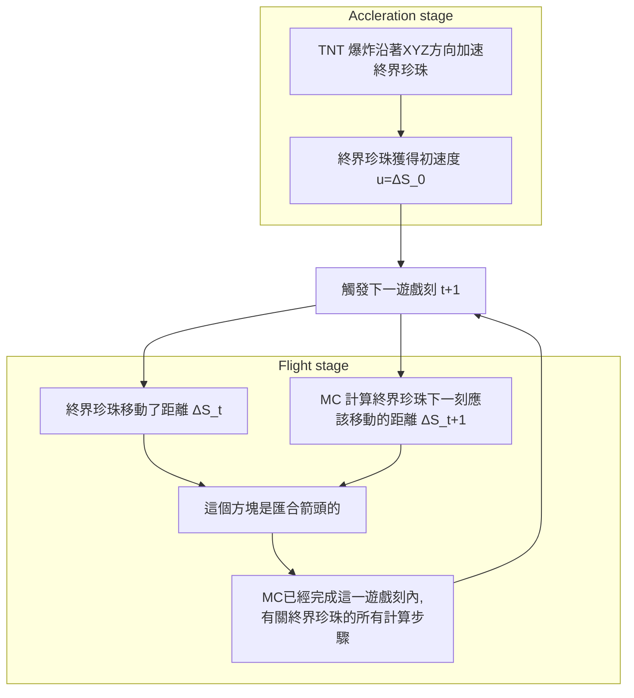

---

title: 終界珍珠軌跡
description: 終界珍珠軌跡公式的解
date: 2020-09-13

---

# 終界珍珠軌跡公式

## 目標

- 已知初速度向量，應用數學模型，以推導其拋射軌跡公式

## 定義

### 差動位移的定義

差動位移向量 $\Delta \vec{S_t}$ 決定 其拋射物下一遊戲刻之移動距離。
$$
\Delta \vec{S_t} = 

\begin{pmatrix}
\Delta x_t \\
\Delta y_t \\
\Delta z_t \\

\end{pmatrix}
$$
而$\Delta \vec{S_t} $的分量如下

- $\Delta x_t$ : 沿著 X 軸方向的分量
- $\Delta y_t$ : 沿著 X 軸方向的分量
- $\Delta z_t$ : 沿著 X 軸方向的分量

### 初速度的定義

初速度 **向量** $\vec{u}$ （通常由TNT爆炸給予）為下
$$
\vec{u} = 

\begin{pmatrix}
\Delta x_0 \\
\Delta y_0 \\
\Delta z_0 \\

\end{pmatrix}
$$
而 $\vec{u}$ 的分量如下

- $u_x = \Delta x_0$ : 沿著 X 軸方向的分量
- $u_y = \Delta y_0$ : 沿著 Y 軸方向的分量
- $u_z = \Delta z_0$ : 沿著 Z 軸方向的分量

留意 $\vec{u}$ （有時候寫作 **u**）只是用來描述 初速度，即 $\Delta \vec{S_0} = \vec{u}$

### 終界珍珠的物理機制

初速度標作  $\vec{u}$，而其絕對值為  $\lvert\vec{u}\rvert = \sqrt{\Delta x_0^2 + \Delta y_0^2 + \Delta z_0^2}$。以下的下劃線`_`寫法指作下標，例如 ΔS_0 指 $\Delta S_0$。



### 終界珍珠的差動位移

終界珍珠的差動位移由以下三個公式定義，這是已知事實。
(來源: [Xcom6000](https://youtu.be/Wc1E1zR40gw))
$$
\begin{align}
\Delta X_{t+1} &= 0.99 \Delta X_t\\
\Delta Y_{t+1} &= 0.99 \Delta Y_t - 0.03\\
\Delta Z_{t+1} &= 0.99 \Delta Z_t\\
\end{align}
$$
而 **終界珍珠的阻力** 是 0.99 ，-0.03是 「**地心引力**」。

如果要跳過加載終界珍珠拋射軌跡經過的所有區塊，終界珍珠的速度 $\lvert\vec{\Delta S_t}\rvert$ 最少要大於 320米每秒，或 16 格每遊戲刻。

## 推導

### 拋射軌跡

拋射軌跡是 終界珍珠受 TNT衝擊而飛行時，其高度對水平距離所形成的曲線。

這是所有差動位移的總和 $\vec{S}(t)$。
$$
\begin{align}
\vec{S}(t) &= \sum_{\tau=0}^t \Delta \vec{S_{\tau}} \\
S_x(t) &= \sum_{\tau=0}^t \Delta x_\tau  \\
S_y(t) &= \sum_{\tau=0}^t \Delta y_\tau  \\
S_z(t) &= \sum_{\tau=0}^t \Delta z_\tau  \\
\end{align}
$$
#### X-Z 軸方向

推導 X-Z 方向的過程是比較簡單的，因為這只是 0.99 的次方。

##### 符號

1. $u_x$ : 沿著 X 軸方向的初速度分量
2. $u_z$ : 沿著 Z 軸方向的初速度分量

##### 推導過程

以下引 X 軸方向 為例，和 Z 軸方向的求導方法相同。以下 $\Delta x$ 指 X 軸方向的差動位移。
$$
\begin{align}
\Delta x_{0} &= u_x\\
\Delta x_{1} &= 0.99 u_x\\
\Delta x_{2} &= 0.99 (\Delta x_{1})\\
\Delta x_{3} &= 0.99 (\Delta x_{2})\\
\Delta x_{k} &= 0.99^k u_x
\end{align}
$$
那麽，其總和就是拋射軌跡的 X 軸方向分量，對於時間 $t$ 的函數 $S_x(t)$。
$$
\begin{align}
S_x(t) &= \sum_{k=0}^t \Delta x_k\\
	&= u_x\sum_{k=0}^t 0.99^k\\
	&= u_x(\frac{1-0.99^t}{1-0.99}) &\quad\quad\text{幾何數列的總和}\\
	&= 100u_x(1-0.99^t)
\end{align}
$$
假設飛行高度不變（$\Delta y_t$ = 0），若 t 趨向無限（$t\to\infty$），飛行距離則為：
$$
\begin{align}
\lim_{t\to\infty}S_x(t) &= \lim_{t\to\infty}\sum_{k=0}^t \Delta x_k\\
	&= \lim_{t\to\infty}u_x\sum_{k=0}^t 0.99^k\\
	&= u_x \frac{1}{1-0.99}\\
	&= 100u_x
\end{align}
$$
Z 軸方向的求導方法相同。

#### Y 軸方向

##### 符號

1. $u_y$：沿著 Y 軸方向的初速度分量
2. 地心引力 = -0.03

##### 推導過程

###### 第 n 遊戲刻的差動位移公式

計算 Y 軸方向的差動位移公式需同時考慮 **終界珍珠的阻力** 和 **地心引力**。因此需要更多步驟來處理。
$$
\begin{align}
\Delta y_{0} &= u_y\\
\Delta y_{1} &= 0.99 u_y - 0.03\\
\Delta y_{2} &= 0.99 (\Delta y_{1}) - 0.03\\
\Delta y_{3} &= 0.99 (\Delta y_{2}) - 0.03\\
\vdots
\end{align}
$$
化簡以上，
$$
\begin{align}
x_1 &= ax + b	&\text{對於符號 $a,b,x_t$}\\
x_2 &= ax_1 + b\\
	&= a(ax + b) + b\\
	&= a^2x+ ab + b \\
x_3	&= ax_2 + b\\
	&= a(a^2x+ ab + b) + b\\
	&= a^3x+a^2b+ab+b\\
\\
\text{證明 $P(n): x_n$}&= a^nx+b(\frac{1-a^{n}}{1-a})\\ \\
P(1) : x_1=ax+b&=a^1x+b(\frac{1-a}{1-a}) &\text{參考 「數學歸納法」}\\
&=ax+b\\
&\therefore\text{$P(1)$ 成立。}\\\\

P(k) 			&= a^kx+b(\frac{1-a^{k}}{1-a})
&\text{證明 $P(k) \to P(k+1)$}\\
aP(k)+b 		&= a(a^kx+b(\frac{1-a^{k}}{1-a})) + b\\
				&=a^{k+1}x+b(\frac{a-a^{k+1}+1-a}{1-a})\\
				&=a^{k+1}x+b(\frac{1-a^{k+1}}{1-a})\\
				&=P(k+1)\\
&\therefore\text{$P(k) \to P(k+1)$ 成立。}\\\\

&\therefore\text{$x_n \equiv a^nx+b(\frac{1-a^{n}}{1-a})$}\\
\end{align}
$$
代入 $a=0.99,b=-0.03$.
$$
\begin{align}
\Delta y_{t} &= 0.99^tu_y-0.03(\frac{1-0.99^t}{1-0.99})\\
\Delta y_{t} &= 0.99^tu_y-3(1-0.99^t)\\
\Delta y_{t} &= 0.99^t(u_y+3)-3
\end{align}
$$

###### Y 軸方向的軌跡公式

$$
\begin{align}
S_y(t) &= 	\sum_{\tau=0}^t \Delta y_{\tau} \\
	&=	\sum_{\tau=0}^t 0.99^\tau(u_y+3)-3\\
	&=	(u_y+3)(\frac{1-0.99^t}{1-0.99})-3t\\
	&=	100(u_y+3)(1-0.99^t)-3t\\
\end{align}
$$

## 繪畫軌跡曲線

我們已經推導了對每一分量的軌跡公式。$L_{xz}(t)$ 是在X-Z平面移動的總距離。
$$
\begin{align}
S_x(t) = x(t)	&=	100u_x(1-0.99^t)\\
S_y(t) = y(t)	&=	100(u_y+3)(1-0.99^t)-3t\\
S_z(t) = z(t)	&=	100u_z(1-0.99^t)\\
L_{xz}(t)		&=	\sqrt{S_x^2(t) + S_z^2(t)}\\
				&=	\sqrt{x^2(t) + z^2(t)}\\
				&=	100(1-0.99^t)\sqrt{u_x^2 + u_z^2}
\end{align}
$$

### X-Y 面

我們須先推導 $x(t)$ 的逆函數來繪畫 $y(x)$。
$$
\begin{align}
x(t) &= 100u_x(1-0.99^t)\\
\frac{x(t)}{100u_x} &= 1-0.99^t\\
0.99^t &= 1-\frac{x(t)}{100u_x}\\
t(x) &= \log_{0.99}{(1-\frac{x}{100u_x})} &\text{$x(t)$ 逆函數}\\
\end{align}
$$
將  $t(x)$ 代入 $t$ 來計算 $y(t)$，
$$
\begin{align}
y(t)	&=	100(u_y+3)(1-0.99^t)-3t\\
y(t(x)) 	&=	100(u_y+3)(1-0.99^{t(x)})-3t(x)
\end{align}
$$
代入  $t(x) = \log_{0.99}{(1-\frac{x}{100u_x})}$，
$$
\begin{align}
y(t(x)) 	&=	100(u_y+3)(1-0.99^{t(x)})-3t(x)\\
y(x) 	&=	100(u_y+3)(1-0.99^{\frac{\log(1-\frac{x}{100u_x})}{\log(99)-2}})-3\frac{\log(1-\frac{x}{100u_x})}{\log(99)-2}\\
\end{align}
$$

### $L_{xz}$-Y 面

推導方法和求得 X-Y 面的方法相似，唯一相異為考慮 $L_{xz}(t)$ 而非 $x(t)$。
$$
\begin{align}
L_{xz}(t)	&=	100(1-0.99^t)\sqrt{u_x^2 + u_z^2}			\\
\frac{L_{xz}(t)}{100\sqrt{u_x^2 + u_z^2}}	&=	1-0.99^t		\\
0.99^t		&=	1-\frac{L_{xz}(t)}{100\sqrt{u_x^2 + u_z^2}}	\\
t(L_{xz}) 	&= \log_{0.99}{(1-\frac{L_{xz}}{100\sqrt{u_x^2 + u_z^2}})} &\text{$L_{xz}(t)$的逆函數}\\
\end{align}
$$
把 $t= t(L_{xz})$ 代入 $y(t)$。
$$
\begin{align}
y(t)	&=	100(u_y+3)(1-0.99^t)-3t\\
y(t(L_{xz})) 	&=	100(u_y+3)(1-0.99^{t(L_{xz})})-3t(L_{xz})
\end{align}
$$
最終答案為
$$
\begin{align}
y(t(L_{xz})) 	&=	100(u_y+3)(1-0.99^{t(L_{xz})})-3t(L_{xz})	\\
y(L_{xz}) 	&=	100(u_y+3)(1-0.99^{\log_{0.99}{(1-\frac{L_{xz}}{100\sqrt{u_x^2 + u_z^2}})}})-3\log_{0.99}{(1-\frac{L_{xz}}{100\sqrt{u_x^2 + u_z^2}})}\\
&=	100(u_y+3)(\frac{L_{xz}}{100\sqrt{u_x^2 + u_z^2}})-3\log_{0.99}{(1-\frac{L_{xz}}{100\sqrt{u_x^2 + u_z^2}})}\\
\end{align}
$$

#### 結果 (Desmos)

:::desmos{key="45bb9b3b9b8c45da9f842ae626539ffd" lang="en"}
```json
{"version":11,"randomSeed":"d39a62d604f46cf8d1b9469f1951e997","graph":{"viewport":{"xmin":-753.8328019055733,"ymin":-948.4011015838091,"xmax":962.1199436683343,"ymax":671.4582902379595},"__v12ViewportLatexStash":{"xmin":"-753.8328019055733","xmax":"962.1199436683343","ymin":"-948.4011015838091","ymax":"671.4582902379595"}},"expressions":{"list":[{"type":"folder","id":"34","title":"Initial velocity","collapsed":true},{"type":"expression","id":"31","folderId":"34","color":"#388c46","latex":"u_{x}=5"},{"type":"expression","id":"14","folderId":"34","color":"#2d70b3","latex":"u_{y}=5","slider":{"hardMin":true,"hardMax":true,"min":"0","max":"5"}},{"type":"expression","id":"15","folderId":"34","color":"#388c46","latex":"u_{z}=0"},{"type":"folder","id":"42","title":"Parameters","collapsed":true},{"type":"text","id":"45","folderId":"42","text":"Pearl drag constant"},{"type":"expression","id":"43","folderId":"42","color":"#2d70b3","latex":"\\alpha=0.99","slider":{"hardMin":true,"hardMax":true,"min":"0","max":"1"}},{"type":"text","id":"46","folderId":"42","text":"Gravity"},{"type":"expression","id":"44","folderId":"42","color":"#388c46","latex":"g=0.03"},{"type":"folder","id":"36","title":"Experimental result (Ux = 5, Uy = 5)","collapsed":true},{"id":"27","type":"table","folderId":"36","columns":[{"values":["0","5","9.95","14.851","19.702","24.505","29.26","33.967","38.628","43.241","47.809","52.331","56.808","61.239","65.627","69.971","74.271","78.528","82.743","86.916","91.047","95.136","99.185","103.19","107.16","111.09","114.98","118.83","122.64","126.41","130.15","133.85","137.51","141.13","144.72","148.28","151.79","155.28","158.72","162.14","165.51","168.86","172.17","175.45","178.69","181.91","185.09","188.24","191.35","194.44","197.5","200.52","203.52","206.48","209.42","212.32","215.2","218.05","220.87","223.66","226.42","229.16","231.87","234.55","237.2","239.83","242.43","245.01","247.56","250.08","252.58","255.05","257.5","259.93","262.33","264.71","267.06","269.39","271.7","273.98","276.24","278.48","280.69","282.88","285.06","287.2","289.33","291.44","293.53","295.59","297.63","299.66","301.66","303.64","305.61","307.55","309.48","311.38","313.27","315.14","316.98","318.81","320.63","322.42","324.2","325.95","327.69","329.42","331.12","332.81","334.48","336.14","337.78","339.4","341.01","342.6","344.17","345.73","347.27","348.8","350.31","351.81","353.29","354.76","356.21","357.65","359.07","360.48","361.87","363.26","364.62","365.98","367.32","368.64","369.96","371.26","372.55","373.82","375.08","376.33","377.57","378.79","380","381.2","382.39","383.57","384.73","385.88","387.03","388.16","389.27","390.38","391.48","392.56","393.64","394.7","395.75","396.8","397.83","398.85","399.86","400.86","401.85","402.84","403.81","404.77","405.72","406.66","407.6","408.52","409.44","410.34","411.24","412.13","413.01","413.88","414.74","415.59","416.43","417.27","418.1","418.92","419.73","420.53","421.32","422.11","422.89","423.66","424.42","425.18","425.93","426.67","427.4","428.13","428.85","429.56","430.26","430.96","431.65","432.33","433.01","433.68","434.34","435","435.65","436.29","436.93","437.56","438.19","438.8","439.42","440.02","440.62","441.22","441.8","442.38","442.96","443.53","444.1","444.66","445.21","445.76","446.3","446.84","447.37","447.89","448.41","448.93","449.44","449.95","450.45","450.94","451.43","451.92","452.4","452.88","453.35","453.81","454.28","454.73","455.19","455.63","456.08","456.52","456.95"],"hidden":true,"id":"25","color":"#2d70b3","latex":"x_{1}"},{"values":["0","5","9.92","14.761","19.523","24.208","28.816","33.348","37.804","42.186","46.494","50.729","54.892","58.983","63.003","66.953","70.834","74.645","78.389","82.065","85.674","89.218","92.696","96.109","99.457","102.74","105.97","109.13","112.22","115.26","118.24","121.16","124.02","126.82","129.56","132.24","134.87","137.44","139.96","142.42","144.82","147.17","149.47","151.72","153.91","156.05","158.14","160.18","162.17","164.11","166","167.84","169.63","171.37","173.07","174.72","176.32","177.88","179.39","180.85","182.27","183.65","184.99","186.28","187.52","188.73","189.89","191.01","192.09","193.13","194.13","195.09","196.01","196.89","197.73","198.53","199.3","200.02","200.71","201.37","201.98","202.56","203.11","203.61","204.09","204.53","204.93","205.3","205.64","205.94","206.21","206.45","206.66","206.83","206.97","207.08","207.16","207.21","207.23","207.22","207.17","207.1","207","206.87","206.71","206.53","206.31","206.07","205.8","205.5","205.17","204.82","204.44","204.04","203.61","203.15","202.67","202.16","201.63","201.08","200.5","199.89","199.26","198.61","197.93","197.23","196.51","195.77","195","194.21","193.4","192.56","191.71","190.83","189.93","189.01","188.07","187.11","186.13","185.13","184.11","183.07","182.01","180.93","179.83","178.71","177.57","176.42","175.24","174.05","172.84","171.61","170.36","169.1","167.82","166.52","165.21","163.87","162.53","161.16","159.78","158.38","156.97","155.54","154.09","152.63","151.15","149.66","148.16","146.63","145.1","143.55","141.98","140.4","138.81","137.2","135.58","133.94","132.29","130.63","128.95","127.26","125.56","123.85","122.12","120.38","118.62","116.86","115.08","113.29","111.48","109.67","107.84","106","104.15","102.29","100.42","98.535","96.64","94.734","92.816","90.888","88.949","87","85.04","83.069","81.089","79.098","77.097","75.086","73.065","71.034","68.994","66.944","64.885","62.816","60.738","58.65","56.554","54.448","52.334","50.21","48.078","45.937","43.788","41.63","39.464","37.289","35.106","32.915","30.716","28.509","26.294","24.071","21.84","19.602","17.356","15.102","12.841","10.573","8.2971","6.0141","3.724","1.4268","-0.87751"],"hidden":true,"id":"26","color":"#fa7e19","latex":"y_{1}"}]},{"type":"folder","id":"35","title":"Helper functions"},{"type":"expression","id":"16","folderId":"35","color":"#6042a6","latex":"t\\left(x\\right)=\\frac{\\left(\\log\\left(u_{x}-x\\left(1-\\alpha\\right)\\right)-\\log\\left(u_{x}\\right)\\right)}{\\log\\left(\\alpha\\right)}","hidden":true},{"type":"text","id":"37","text":"Trajectory"},{"type":"expression","id":"17","color":"#000000","latex":"y\\left(x\\right)=u_{y}\\left(\\frac{1-\\alpha^{t\\left(x\\right)}}{1-\\alpha}\\right)-\\frac{gt\\left(x\\right)}{1-\\alpha}+\\frac{g\\left(1-\\alpha^{t\\left(x\\right)}\\right)}{\\left(1-\\alpha\\right)^{2}}"},{"type":"text","id":"38","text":"Initial pitch angle"},{"type":"expression","id":"20","color":"#388c46","latex":"x\\left(\\frac{u_{y}}{\\sqrt{u_{x}^{2}+u_{z}^{2}}}\\right)","hidden":true},{"type":"expression","id":"39","color":"#2d70b3"},{"type":"expression","id":"40","color":"#388c46"}]},"includeFunctionParametersInRandomSeed":true,"doNotMigrateMovablePointStyle":true}
```
:::

## 通用軌跡公式

留意以下
$$
\begin{align}
\Delta x_1 &= \alpha u_x\\
\Delta y_1 &= \alpha u_y + g\\
\Delta z_1 &= \alpha u_z
\end{align}
$$
上一章節推導了以 $\alpha=0.99, g=-0.03$ 的特解，以下將推算其通解。

### 差動位移

差動位移的計算方法和之前的非常相似，$t$ 代表時間。
$$
\begin{align}
\Delta x_t &= \alpha^t u_x\\
\Delta y_t &= \alpha^t u_y + g \frac{1-\alpha^t}{1-\alpha}\\
\Delta z_t &= \alpha^t u_z
\end{align}
$$

### 拋射軌跡公式的分量

和之前相似，拋射軌跡公式是由時間 0 到時間 $t$ 的差動位移總和。

#### X/Z/$L_{xz}$ 軸方向

沿用之前使用過的符號， $S_x(t)=x(t), S_z(t)=z(t), L_{xz}(t)=\sqrt{x^2(t)+z^2(t)}$
$$
\begin{align}
x(t) 		&= \sum_{\tau=0}^t \alpha^\tau u_x\\
			&= u_x\sum_{\tau=0}^t\alpha^\tau\\
			&= u_x \frac{1-\alpha^t}{1-\alpha}\\
			\\
z(t) 		&= \sum_{\tau=0}^t \alpha^\tau u_z\\
			&= u_z\sum_{\tau=0}^t \alpha^\tau \\
			&= u_z \frac{1-\alpha^t}{1-\alpha}\\
			\\
L_{xz}(t) 	&= \sqrt{x^2(t)+z^2(t)}\\
			&= \sqrt{(u_x \frac{1-\alpha^t}{1-\alpha})^2+(u_z \frac{1-\alpha^t}{1-\alpha})^2}\\
			&= \frac{1-\alpha^t}{1-\alpha}\sqrt{u_x^2+u_z^2}
\end{align}
$$

#### Y 軸方向

推導 Y 軸方向需要一點點苦功和謹慎。~~因為我大意錯了幾次。~~
$$
\begin{align}
 S_y(t)&=y(t) \\
y(t)	&=	\sum_{\tau=0}^t (\alpha^\tau u_y+g(\frac{1-\alpha^\tau}{1-\alpha}))\\
		&=	u_y\sum_{\tau=0}^t \alpha^\tau + \frac{g}{1-\alpha}\sum_{\tau=0}^t(1-\alpha^\tau)\\
		&=	u_y\frac{1-\alpha^t}{1-\alpha} + \frac{g}{1-\alpha}\sum_{\tau=0}^t 1 -\frac{g}{1-\alpha}\sum_{\tau=0}^t \alpha^\tau\\
		&=	u_y\frac{1-\alpha^t}{1-\alpha} + \frac{gt}{1-\alpha} -\frac{g}{1-\alpha}\frac{1-\alpha^t}{1-a}\\
		&=	u_y\frac{1-\alpha^t}{1-\alpha} + \frac{gt}{1-\alpha} -g\frac{(1-\alpha^t)}{(1-\alpha)^2}\\
		&= (u_y-\frac{g}{1-\alpha})(\frac{1-\alpha^t}{1-\alpha}) + \frac{gt}{1-\alpha}
\end{align}
$$

#### 於 $L_{xz}$-Y 面繪製通用拋射軌跡公式

##### 推算 $L_{xz}(t) = \sqrt{S_x^2(t)+S_z^2(t)}$ 的逆函數

$$
\begin{align}
L_{xz}(t) &= \frac{1-\alpha^t}{1-\alpha}\sqrt{u_x^2+u_z^2}\\
L_{xz}(t)\frac{1-\alpha}{\sqrt{u_x^2+u_z^2}} &=1-\alpha^t\\
\alpha^t &=1-L_{xz}(t)\frac{1-\alpha}{\sqrt{u_x^2+u_z^2}}\\
t(L_{xz}) &= \log_\alpha({1-L_{xz}\frac{1-\alpha}{\sqrt{u_x^2+u_z^2}}}) &\text{$L_{xz}(t)$的逆函數}
\end{align}
$$

##### 代入 $t=t(L_{xz})$

$$
\begin{align}
y(t)			&= 	(u_y-\frac{g}{1-\alpha})(\frac{1-\alpha^t}{1-\alpha}) + \frac{gt}{1-\alpha}\\
y(t(L_{xz}))	&= 	(u_y-\frac{g}{1-\alpha})(\frac{1-\alpha^{t(L_{xz})}}{1-\alpha}) + \frac{gt(L_{xz})}{1-\alpha}
\end{align}
$$

##### 最後一步...

$$
\begin{align}
y(t(L_{xz}))	
&= 	(u_y-\frac{g}{1-\alpha})(\frac{1-\alpha^{t(L_{xz})}}{1-\alpha}) + \frac{gt(L_{xz})}{1-\alpha}\\
&= 	(u_y-\frac{g}{1-\alpha})(\frac{1-\alpha^{\log_\alpha({1-L_{xz}\frac{1-\alpha}{\sqrt{u_x^2+u_z^2}}}))}}{1-\alpha}) + \frac{g\log_\alpha({1-L_{xz}\frac{1-\alpha}{\sqrt{u_x^2+u_z^2}}})}{1-\alpha}\\
&= 	(u_y-\frac{g}{1-\alpha})(\frac{L_{xz}\frac{1-\alpha}{\sqrt{u_x^2+u_z^2}}}{1-\alpha}) + \frac{g\log_\alpha({1-L_{xz}\frac{1-\alpha}{\sqrt{u_x^2+u_z^2}}})}{1-\alpha}\\
&= 	(u_y-\frac{g}{1-\alpha})(\frac{L_{xz}}{\sqrt{u_x^2+u_z^2}}) + \frac{g}{1-\alpha}\log_\alpha({1-L_{xz}\frac{1-\alpha}{\sqrt{u_x^2+u_z^2}}})\\
\\
&=\left(u_{y}-\frac{g}{1-\alpha}\right)\left(\frac{L_{xz}}{\sqrt{u_{x}^{2}+u_{z}^{2}}}\right)+\frac{g}{1-\alpha}\log_{\alpha}\left(1-\frac{L_{xz}\left(1-\alpha\right)}{\sqrt{u_{x}^{2}+u_{z}^{2}}}\right)
\end{align}
$$

## 編者

- computerbigboom @ HKRAE (香港紅石及建築交流伺服器)

- HyperXraft @ HKRAE (香港紅石及建築交流伺服器)

[馬上加入 HKRAE!](https://discord.gg/9sSRkZH)

2020-09-13

---

[返回主頁](/)