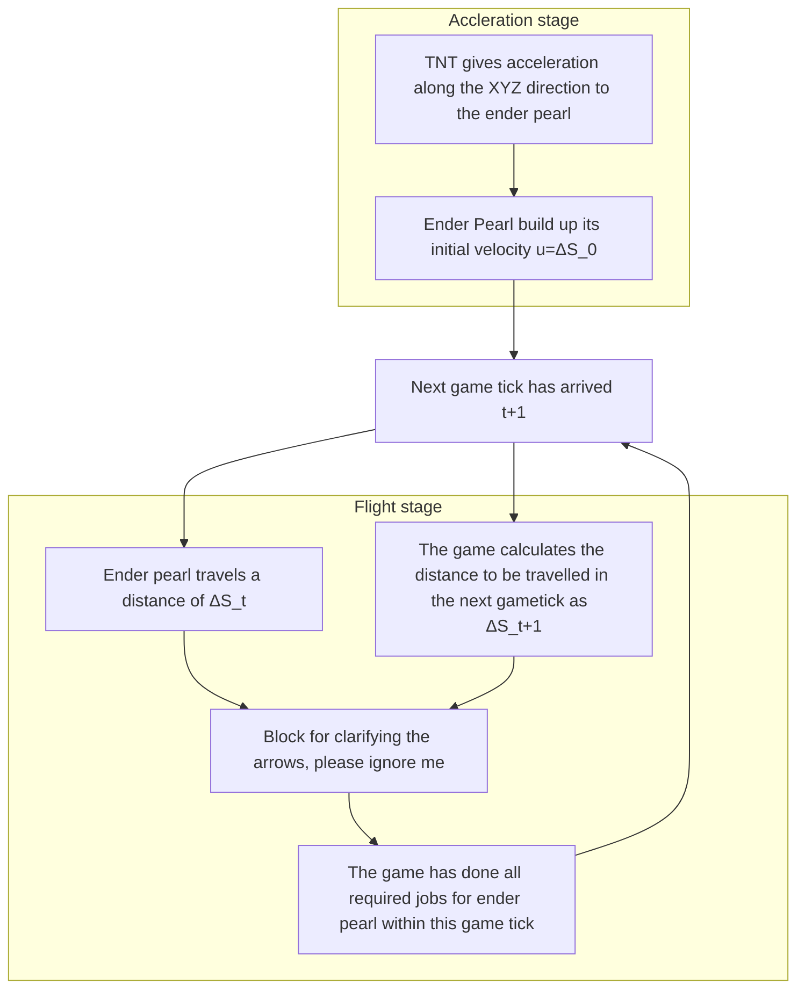

---

title: Ender Pearl Trajectory
description: Solution to the trajectory of flying ender pearl in minecraft.
date: 2020-09-13

---

# Ender Pearl Trajectory

## Objective

1. To investigate the trajectory of an ender pearl given its initial velocity vector.
2. To apply mathematical model to formulate the trajectory.
3. To predict the fly track accurately using math models and tools.

## Definitions

### Definition of displacement differnetials

The displacement differential vector $\Delta \vec{S_t}$ determines how far the projectile needs to be travelled in the next game tick.
$$
\begin{align}
\Delta \vec{S_t} = 

\begin{pmatrix}
\Delta x_t \\
\Delta y_t \\
\Delta z_t \\

\end{pmatrix}
\end{align}
$$
Where componenets of $\Delta \vec{S_t} $ are the following

- $\Delta x_t$ : Along the X direction
- $\Delta y_t$ : Along the Y direction
- $\Delta z_t$ : Along the Z direction

### Definition of initial velocity

The initial velocity **vector** $\vec{u}$ (often supplied by TNT explosions) are given by
$$
\begin{align}
\vec{u} = 

\begin{pmatrix}
\Delta x_0 \\
\Delta y_0 \\
\Delta z_0 \\

\end{pmatrix}
\end{align}
$$
The components of $\vec{u}$ are symbolized as below

- $u_x = \Delta x_0$ : Initial velocity along X direction
- $u_y = \Delta y_0$ : Initial velocity along Y direction
- $u_z = \Delta z_0$ : Initial velocity along Z direction

 

Note that symbol $\vec{u}$ (sometimes written as **u**) *is only used* to describe initial velocity at **t=0**.
Note that $\Delta \vec{S_0} = \vec{u}$

### Ender Pearl physics

The initial velocity is given by $\vec{u}$, where $\lvert\vec{u}\rvert = \sqrt{\Delta x_0^2 + \Delta y_0^2 + \Delta z_0^2}$. The notation of ΔS_0 represents a subscript, i.e. $\Delta S_0$

### Ender Pearl Displacement Differential

The displacement differential are given by the following three formulas. These are known facts.
(Source: [Xcom6000](https://youtu.be/Wc1E1zR40gw))
$$
\begin{align}
\Delta X_{t+1} &= 0.99 \Delta X_t\\
\Delta Y_{t+1} &= 0.99 \Delta Y_t - 0.03\\
\Delta Z_{t+1} &= 0.99 \Delta Z_t\\
\end{align}
$$
Where 0.99 is the **pearl drag**, -0.03 would be the **gravity**.

To skip chunk loading for all chunks in flight (Only center chunks), $\lvert\vec{\Delta S_t}\rvert > 320$ m/s, or  $16$ blocks/tick (i.e. the side length of 1 chunk).

## Derivation

### Trajectory

Trajectory is the flight curve that an ender pearl has travelled.

This would be the sum of displacement differential $\vec{S}(t)$ In other words
$$
\begin{align}
\vec{S}(t) &= \sum_{\tau=0}^t \Delta \vec{S_{\tau}} \\
S_x(t) &= \sum_{\tau=0}^t \Delta x_\tau  \\
S_y(t) &= \sum_{\tau=0}^t \Delta y_\tau  \\
S_z(t) &= \sum_{\tau=0}^t \Delta z_\tau  \\
\end{align}
$$
#### X-Z direction

Deriving on X-Z would be rather simple as it is just a matter of the powers of 0.99

##### Variables

1. $u_x$
2. $u_z$

##### Derivation

Take X direction for example, same for Z direction. In here, the $\Delta x$ means the displacement differential on X direction.
$$
\begin{align}
\Delta x_{0} &= u_x\\
\Delta x_{1} &= 0.99 u_x\\
\Delta x_{2} &= 0.99 (\Delta x_{1})\\
\Delta x_{3} &= 0.99 (\Delta x_{2})\\
\Delta x_{k} &= 0.99^k u_x
\end{align}
$$
Then its sum, i.e. the X component of the trajectory with respect to time $S_x(t)$ would be
$$
\begin{align}
S_x(t) &= \sum_{k=0}^t \Delta x_k\\
	&= u_x\sum_{k=0}^t 0.99^k\\
	&= u_x(\frac{1-0.99^t}{1-0.99}) &\quad\quad\text{Sum of GS}\\
	&= 100u_x(1-0.99^t)
\end{align}
$$
There will be a flight distance limit, if $t\to\infty$. (Assume constant height, $\Delta y_t$ = 0)
$$
\begin{align}
\lim_{t\to\infty}S_x(t) &= \lim_{t\to\infty}\sum_{k=0}^t \Delta x_k\\
	&= \lim_{t\to\infty}u_x\sum_{k=0}^t 0.99^k\\
	&= u_x \frac{1}{1-0.99}\\
	&= 100u_x
\end{align}
$$
Same goes for Z direction.

#### Y-direction

##### Variables

1. $u_y$
2. **Gravity** = -0.03

##### Derivation

###### n tick displacement differential formula

The Y direction have both **pearl drag** and **gravity**. It takes some more steps to tackle it.
$$
\begin{align}
\Delta y_{0} &= u_y\\
\Delta y_{1} &= 0.99 u_y - 0.03\\
\Delta y_{2} &= 0.99 (\Delta y_{1}) - 0.03\\
\Delta y_{3} &= 0.99 (\Delta y_{2}) - 0.03\\
\vdots
\end{align}
$$
Simplifying the expression
$$
\begin{align}
x_1 &= ax + b	&\text{Consider variables $a,b,x_t$}\\
x_2 &= ax_1 + b\\
	&= a(ax + b) + b\\
	&= a^2x+ ab + b \\
x_3	&= ax_2 + b\\
	&= a(a^2x+ ab + b) + b\\
	&= a^3x+a^2b+ab+b\\
\\
\text{Proposition $P(n): x_n$}&= a^nx+b(\frac{1-a^{n}}{1-a})\\ \\
P(1) : x_1=ax+b&=a^1x+b(\frac{1-a}{1-a}) &\text{See Mathematical induction}\\
&=ax+b\\
&\therefore\text{$P(1)$ is true.}\\\\

P(k) 			&= a^kx+b(\frac{1-a^{k}}{1-a})
&\text{Prove $P(k) \to P(k+1)$}\\
aP(k)+b 		&= a(a^kx+b(\frac{1-a^{k}}{1-a})) + b\\
				&=a^{k+1}x+b(\frac{a-a^{k+1}+1-a}{1-a})\\
				&=a^{k+1}x+b(\frac{1-a^{k+1}}{1-a})\\
				&=P(k+1)\\
&\therefore\text{$P(k) \to P(k+1)$ is true.}\\\\

&\therefore\text{$x_n \equiv a^nx+b(\frac{1-a^{n}}{1-a})$}\\
\end{align}
$$
Subsititude $a=0.99,b=-0.03$.
$$
\begin{align}
\Delta y_{t} &= 0.99^tu_y-0.03(\frac{1-0.99^t}{1-0.99})\\
\Delta y_{t} &= 0.99^tu_y-3(1-0.99^t)\\
\Delta y_{t} &= 0.99^t(u_y+3)-3
\end{align}
$$

###### Trajectory formula on Y axis

$$
\begin{align}
S_y(t) &= 	\sum_{\tau=0}^t \Delta y_{\tau} \\
	&=	\sum_{\tau=0}^t 0.99^\tau(u_y+3)-3\\
	&=	(u_y+3)(\frac{1-0.99^t}{1-0.99})-3t\\
	&=	100(u_y+3)(1-0.99^t)-3t\\
\end{align}
$$

## Plotting the trajectory curve

We have obtained these trajectory formulas for individual components. $L_{xz}(t)$ is the total distance travelled on the X-Z plane.
$$
\begin{align}
S_x(t) = x(t)	&=	100u_x(1-0.99^t)\\
S_y(t) = y(t)	&=	100(u_y+3)(1-0.99^t)-3t\\
S_z(t) = z(t)	&=	100u_z(1-0.99^t)\\
L_{xz}(t)		&=	\sqrt{S_x^2(t) + S_z^2(t)}\\
				&=	\sqrt{x^2(t) + z^2(t)}\\
				&=	100(1-0.99^t)\sqrt{u_x^2 + u_z^2}
\end{align}
$$

### X-Y plane

We want to plot $y(x)$. To plot this, we first find inverse of $x(t)$ to resolve $t=x^{-1}(x)$.
$$
\begin{align}
x(t) &= 100u_x(1-0.99^t)\\
\frac{x(t)}{100u_x} &= 1-0.99^t\\
0.99^t &= 1-\frac{x(t)}{100u_x}\\
t(x) &= \log_{0.99}{(1-\frac{x}{100u_x})} &\text{Inverse of $x(t)$}\\
\end{align}
$$
Now to plot it we can simply subsititude $t=t(x)$ to get $y(t)$
$$
\begin{align}
y(t)	&=	100(u_y+3)(1-0.99^t)-3t\\
y(t(x)) 	&=	100(u_y+3)(1-0.99^{t(x)})-3t(x)
\end{align}
$$
To link up all, where $t(x) = \log_{0.99}{(1-\frac{x}{100u_x})}$
$$
\begin{align}
y(t(x)) 	&=	100(u_y+3)(1-0.99^{t(x)})-3t(x)\\
y(x) 	&=	100(u_y+3)(1-0.99^{\frac{\log(1-\frac{x}{100u_x})}{\log(99)-2}})-3\frac{\log(1-\frac{x}{100u_x})}{\log(99)-2}\\
\end{align}
$$

### $L_{xz}$-Y plane

The method of deriving is very similar to the way we derived X-Y plane. The only difference would be considering $L_{xz}(t)$ instead of $x(t)$.
$$
\begin{align}
L_{xz}(t)	&=	100(1-0.99^t)\sqrt{u_x^2 + u_z^2}			\\
\frac{L_{xz}(t)}{100\sqrt{u_x^2 + u_z^2}}	&=	1-0.99^t		\\
0.99^t		&=	1-\frac{L_{xz}(t)}{100\sqrt{u_x^2 + u_z^2}}	\\
t(L_{xz}) 	&= \log_{0.99}{(1-\frac{L_{xz}}{100\sqrt{u_x^2 + u_z^2}})} &\text{Inverse of $L_{xz}(t)$}\\
\end{align}
$$
Subsititude it to $y(t)$ where $t= t(L_{xz})$.
$$
\begin{align}
y(t)	&=	100(u_y+3)(1-0.99^t)-3t\\
y(t(L_{xz})) 	&=	100(u_y+3)(1-0.99^{t(L_{xz})})-3t(L_{xz})
\end{align}
$$
One step further, but often unnecessary,
$$
\begin{align}
y(t(L_{xz})) 	&=	100(u_y+3)(1-0.99^{t(L_{xz})})-3t(L_{xz})	\\
y(L_{xz}) 	&=	100(u_y+3)(1-0.99^{\log_{0.99}{(1-\frac{L_{xz}}{100\sqrt{u_x^2 + u_z^2}})}})-3\log_{0.99}{(1-\frac{L_{xz}}{100\sqrt{u_x^2 + u_z^2}})}\\
&=	100(u_y+3)(\frac{L_{xz}}{100\sqrt{u_x^2 + u_z^2}})-3\log_{0.99}{(1-\frac{L_{xz}}{100\sqrt{u_x^2 + u_z^2}})}\\
\end{align}
$$

#### Result (Desmos)

::desmos{key="45bb9b3b9b8c45da9f842ae626539ffd" lang="en" state='{"version":8,"graph":{"viewport":{"xmin":-473.26235706674674,"ymin":-420.29042351634354,"xmax":1046.7511476630834,"ymax":508.8445920509045}},"randomSeed":"d39a62d604f46cf8d1b9469f1951e997","expressions":{"list":[{"type":"folder","id":"34","title":"Initial velocity"},{"type":"expression","id":"31","folderId":"34","color":"#388c46","latex":"u_{x}=3.535533905"},{"type":"expression","id":"14","folderId":"34","color":"#2d70b3","latex":"u_{y}=5","slider":{"hardMin":true,"hardMax":true,"min":"0","max":"5"}},{"type":"expression","id":"15","folderId":"34","color":"#388c46","latex":"u_{z}=3.535533905"},{"type":"folder","id":"42","title":"Parameters"},{"type":"text","id":"45","folderId":"42","text":"Drag constant"},{"type":"expression","id":"43","folderId":"42","color":"#2d70b3","latex":"\\\\alpha=0.99","slider":{"hardMin":true,"hardMax":true,"min":"0","max":"1"}},{"type":"text","id":"46","folderId":"42","text":"Gravity"},{"type":"expression","id":"44","folderId":"42","color":"#388c46","latex":"g=-0.03","slider":{"hardMax":true,"max":"0"}},{"type":"folder","id":"36","title":"Experimental result (Ux = 5, Uy = 5)","collapsed":true},{"id":"27","type":"table","folderId":"36","columns":[{"values":["0","5","9.95"],"hidden":true,"id":"25","color":"#2d70b3","latex":"x_{1}"},{"values":["0","5","9.92"],"hidden":true,"id":"26","color":"#fa7e19","latex":"y_{1}"}]},{"type":"folder","id":"35","title":"Inverse of L_xz(t)","collapsed":true},{"type":"expression","id":"16","folderId":"35","color":"#6042a6","latex":"t\\\\left(x\\\\right)=\\\\frac{\\\\left(\\\\log\\\\left(\\\\sqrt{u_{x}^{2}+u_{z}^{2}}-x\\\\left(1-\\\\alpha\\\\right)\\\\right)-\\\\log\\\\left(\\\\sqrt{u_{x}^{2}+u_{z}^{2}}\\\\right)\\\\right)}{\\\\log\\\\left(\\\\alpha\\\\right)}","hidden":true},{"type":"text","id":"37","text":"Trajectory"},{"type":"expression","id":"17","color":"#000000","latex":"f\\\\left(x\\\\right)=u_{y}\\\\left(\\\\frac{1-\\\\alpha^{t\\\\left(x\\\\right)}}{1-\\\\alpha}\\\\right)+\\\\frac{gt\\\\left(x\\\\right)}{1-\\\\alpha}-\\\\frac{g\\\\left(1-\\\\alpha^{t\\\\left(x\\\\right)}\\\\right)}{\\\\left(1-\\\\alpha\\\\right)^{2}}"},{"type":"folder","id":"48","title":"Extras","collapsed":true},{"type":"text","id":"38","folderId":"48","text":"Initial pitch angle"},{"type":"expression","id":"20","folderId":"48","color":"#388c46","latex":"\\\\arctan\\\\left(\\\\frac{u_{y}}{\\\\sqrt{u_{x}^{2}+u_{z}^{2}}}\\\\right)","hidden":true}]}}'}

## Generalized projectile trajectory

Consider the following
$$
\begin{align}
\Delta x_1 &= \alpha u_x\\
\Delta y_1 &= \alpha u_y + g\\
\Delta z_1 &= \alpha u_z
\end{align}
$$
In the previous section, we have derived the particular solution for $\alpha=0.99, g=-0.03$. In this section, we will make our attempt to obtain a general solution.

### Displacement differentials

The displacement differentials are very similar as before. $t$ represents the number of game ticks eplased.
$$
\begin{align}
\Delta x_t &= \alpha^t u_x\\
\Delta y_t &= \alpha^t u_y + g \frac{1-\alpha^t}{1-\alpha}\\
\Delta z_t &= \alpha^t u_z
\end{align}
$$

### Components of trajectory

Similar as before, the trajectory is the sum of displacement differentials from 0 to $t$.

#### X/Z/$L_{xz}$ direction

Following the same notation as above, $S_x(t)=x(t), S_z(t)=z(t), L_{xz}(t)=\sqrt{x^2(t)+z^2(t)}$
$$
\begin{align}
x(t) 		&= \sum_{\tau=0}^t \alpha^\tau u_x\\
			&= u_x\sum_{\tau=0}^t\alpha^\tau\\
			&= u_x \frac{1-\alpha^t}{1-\alpha}\\
			\\
z(t) 		&= \sum_{\tau=0}^t \alpha^\tau u_z\\
			&= u_z\sum_{\tau=0}^t \alpha^\tau \\
			&= u_z \frac{1-\alpha^t}{1-\alpha}\\
			\\
L_{xz}(t) 	&= \sqrt{x^2(t)+z^2(t)}\\
			&= \sqrt{(u_x \frac{1-\alpha^t}{1-\alpha})^2+(u_z \frac{1-\alpha^t}{1-\alpha})^2}\\
			&= \frac{1-\alpha^t}{1-\alpha}\sqrt{u_x^2+u_z^2}
\end{align}
$$

#### Y direction

Deriving Y-direction takes a little bit of hard work and extra attention. ~~I must not say I was way too careless~~
$$
\begin{align}
 S_y(t)&=y(t) \\
y(t)	&=	\sum_{\tau=0}^t (\alpha^\tau u_y+g(\frac{1-\alpha^\tau}{1-\alpha}))\\
		&=	u_y\sum_{\tau=0}^t \alpha^\tau + \frac{g}{1-\alpha}\sum_{\tau=0}^t(1-\alpha^\tau)\\
		&=	u_y\frac{1-\alpha^t}{1-\alpha} + \frac{g}{1-\alpha}\sum_{\tau=0}^t 1 -\frac{g}{1-\alpha}\sum_{\tau=0}^t \alpha^\tau\\
		&=	u_y\frac{1-\alpha^t}{1-\alpha} + \frac{gt}{1-\alpha} -\frac{g}{1-\alpha}\frac{1-\alpha^t}{1-a}\\
		&=	u_y\frac{1-\alpha^t}{1-\alpha} + \frac{gt}{1-\alpha} -g\frac{(1-\alpha^t)}{(1-\alpha)^2}\\
		&= (u_y-\frac{g}{1-\alpha})(\frac{1-\alpha^t}{1-\alpha}) + \frac{gt}{1-\alpha}
\end{align}
$$

#### Plotting generalized trajectory on $L_{xz}$-Y plane

##### Derive inverse of $L_{xz}(t) = \sqrt{S_x^2(t)+S_z^2(t)}$

$$
\begin{align}
L_{xz}(t) &= \frac{1-\alpha^t}{1-\alpha}\sqrt{u_x^2+u_z^2}\\
L_{xz}(t)\frac{1-\alpha}{\sqrt{u_x^2+u_z^2}} &=1-\alpha^t\\
\alpha^t &=1-L_{xz}(t)\frac{1-\alpha}{\sqrt{u_x^2+u_z^2}}\\
t(L_{xz}) &= \log_\alpha({1-L_{xz}\frac{1-\alpha}{\sqrt{u_x^2+u_z^2}}}) &\text{Inverse of $L_{xz}(t)$}
\end{align}
$$

##### Substitute $t=t(L_{xz})$

$$
\begin{align}
y(t)			&= 	(u_y-\frac{g}{1-\alpha})(\frac{1-\alpha^t}{1-\alpha}) + \frac{gt}{1-\alpha}\\
y(t(L_{xz}))	&= 	(u_y-\frac{g}{1-\alpha})(\frac{1-\alpha^{t(L_{xz})}}{1-\alpha}) + \frac{gt(L_{xz})}{1-\alpha}
\end{align}
$$

##### One last step...

$$
\begin{align}
y(t(L_{xz}))	
&= 	(u_y-\frac{g}{1-\alpha})(\frac{1-\alpha^{t(L_{xz})}}{1-\alpha}) + \frac{gt(L_{xz})}{1-\alpha}\\
&= 	(u_y-\frac{g}{1-\alpha})(\frac{1-\alpha^{\log_\alpha({1-L_{xz}\frac{1-\alpha}{\sqrt{u_x^2+u_z^2}}}))}}{1-\alpha}) + \frac{g\log_\alpha({1-L_{xz}\frac{1-\alpha}{\sqrt{u_x^2+u_z^2}}})}{1-\alpha}\\
&= 	(u_y-\frac{g}{1-\alpha})(\frac{L_{xz}\frac{1-\alpha}{\sqrt{u_x^2+u_z^2}}}{1-\alpha}) + \frac{g\log_\alpha({1-L_{xz}\frac{1-\alpha}{\sqrt{u_x^2+u_z^2}}})}{1-\alpha}\\
&= 	(u_y-\frac{g}{1-\alpha})(\frac{L_{xz}}{\sqrt{u_x^2+u_z^2}}) + \frac{g}{1-\alpha}\log_\alpha({1-L_{xz}\frac{1-\alpha}{\sqrt{u_x^2+u_z^2}}})\\
\\
&=\left(u_{y}-\frac{g}{1-\alpha}\right)\left(\frac{L_{xz}}{\sqrt{u_{x}^{2}+u_{z}^{2}}}\right)+\frac{g}{1-\alpha}\log_{\alpha}\left(1-\frac{L_{xz}\left(1-\alpha\right)}{\sqrt{u_{x}^{2}+u_{z}^{2}}}\right)
\end{align}
$$

## Author 

- computerbigboom@HKRAE

- HyperXraft@HKRAE

[Join HKRAE!](https://discord.gg/9sSRkZH)

2020-09-13

---

[Back to home](/)

