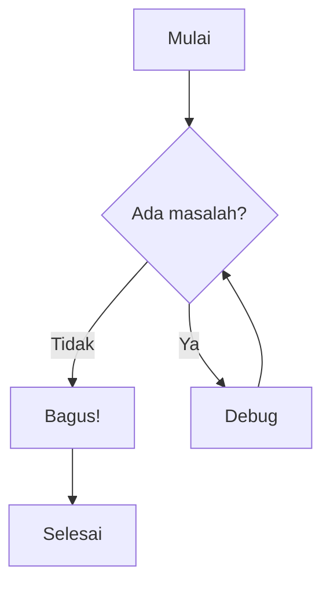
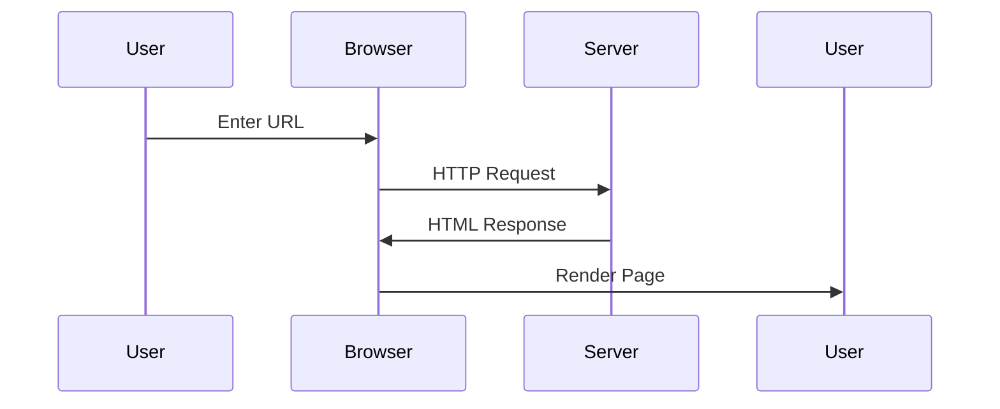
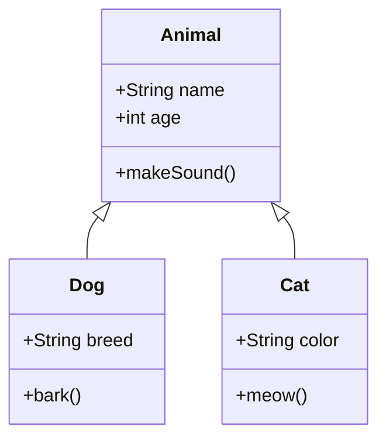

---

title: "Contoh Artikel"
description: "Demo Semua Fitur."
---

# Contoh Artikel Blog

Ini adalah demonstrasi sederhana semua fitur Markdown.

## 1. Sorotan Teks

Anda bisa ==menyorot teks== dengan dua tanda sama dengan.

Contoh lain: Ini adalah informasi ==sangat penting==!

### 1.1.1 Variasi Font

- **Teks Tebal**
- *Teks Miring*
- ***Teks Tebal Miring***
- `Teks Monospace`
- ~~Teks Dicoret~~
- x_subscript_
- x^superscript^
- Tombol <kbd>Ctrl</kbd> + <kbd>C</kbd>

### 1.1.2 Code section

#### C

```c
#include <stdio.h>

int main(void) {
    printf("Hello, World!\n");
    return 0;
}
```

#### Python

```python
def hello_world():
    print("Hello, World!")
```

#### Rust

```rust
fn main() {
    println!("Hello, World!");
}
```

## 2. Tombol Keyboard

Copy: <kbd>Ctrl</kbd> + <kbd>C</kbd>

Paste di macOS: <kbd>⌘</kbd> + <kbd>V</kbd>

## 3. Subscript dan Superscript

Rumus kimia air: H_2_O

Persamaan Einstein: E = mc^2^

Contoh lain: x^2^ + y^2^ = z^2^ dan emisi CO_2_

## 4. Rumus Matematika (LaTeX)

### Rumus Inline

Rumus kuadrat: $x = \frac{-b \pm \sqrt{b^2 - 4ac}}{2a}$

Luas lingkaran: $A = \pi r^2$

### Rumus Blok

$$
\int_{-\infty}^{\infty} e^{-x^2} dx = \sqrt{\pi}
$$

$$
\sum_{n=1}^{\infty} \frac{1}{n^2} = \frac{\pi^2}{6}
$$

$$
a_0 = \frac{1}{L} \int_{-L}^{L} f(x) \, dx
$$

$$
a_n = \frac{1}{L} \int_{-L}^{L} f(x) \cos\left(\frac{n\pi x}{L}\right) dx, \quad n = 1, 2, 3, \ldots
$$

$$
b_n = \frac{1}{L} \int_{-L}^{L} f(x) \sin\left(\frac{n\pi x}{L}\right) dx, \quad n = 1, 2, 3, \ldots
$$

$$
\iiint_R f(x, y, z) \, dx \, dy \, dz = \iiint_S f(x(u,v,w), y(u,v,w), z(u,v,w)) \left| J \right| \, du \, dv \, dw
$$

$$
J = \frac{\partial(x, y, z)}{\partial(u, v, w)} = \begin{vmatrix}
\frac{\partial x}{\partial u} & \frac{\partial x}{\partial v} & \frac{\partial x}{\partial w} \\
\frac{\partial y}{\partial u} & \frac{\partial y}{\partial v} & \frac{\partial y}{\partial w} \\
\frac{\partial z}{\partial u} & \frac{\partial z}{\partial v} & \frac{\partial z}{\partial w}
\end{vmatrix}
$$

$$
\vec{a} \times \vec{b} = \begin{vmatrix}
\vec{i} & \vec{j} & \vec{k} \\
a_1 & a_2 & a_3 \\
b_1 & b_2 & b_3
\end{vmatrix}
$$


## 5. Diagram Mermaid

### Flowchart



### Sequence Diagram



### Class Diagram



## Kesimpulan

Semua fitur sudah berjalan! Sekarang Anda bisa:

- ==menyorot== teks penting
- menampilkan tombol seperti <kbd>Ctrl</kbd> + <kbd>C</kbd>
- menulis subscript (H_2_O) dan superscript (x^2^)
- menambahkan rumus inline $\alpha + \beta = \gamma$ dan blok
- membuat diagram Mermaid yang indah

---

[Kembali ke Beranda](/)
