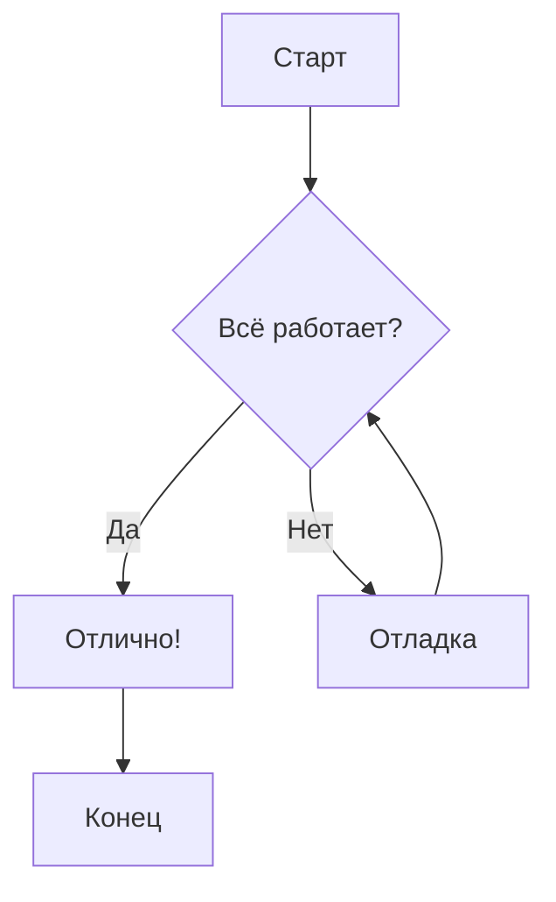
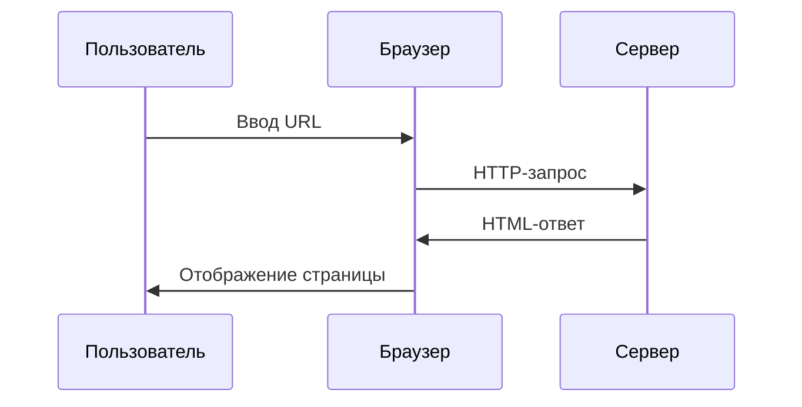
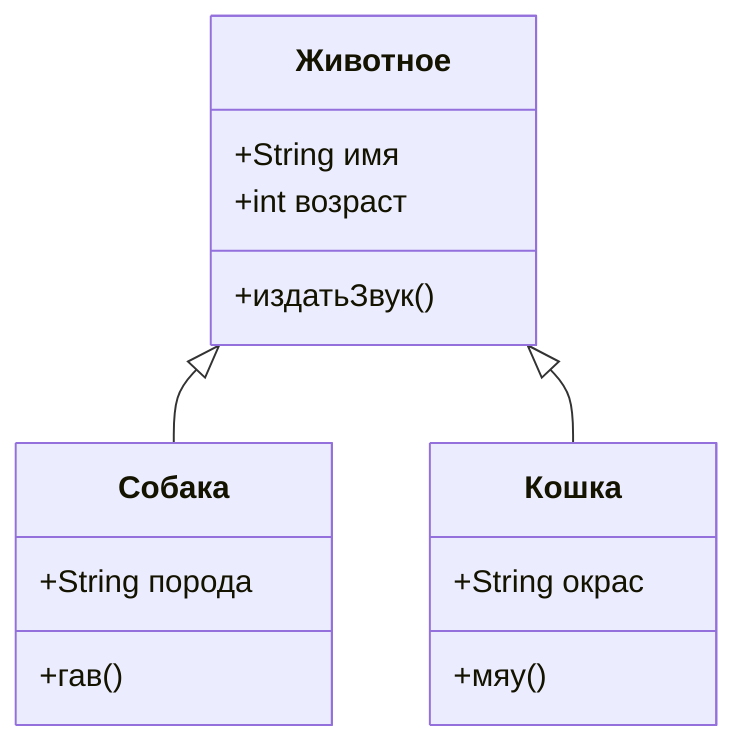

---

title: "Пример статьи"
description: "демонстрация всех функций."

---

# Пример статьи

Эта статья — простая демонстрация всех запрошенных вами возможностей Markdown (на русском языке).

## 1. Выделение текста

Вы можете ==выделять текст== с помощью двойных знаков равенства.

Ещё пример: это ==очень важная== информация!

### 1.1.1 Варианты шрифта

- **Жирный**
- *Курсив*
- ***Жирный курсив***
- `Моноширинный`
- ~~Зачёркнутый~~
- x_нижний индекс_
- x^верхний индекс^
- Клавиши <kbd>Ctrl</kbd> + <kbd>C</kbd>

### 1.1.2 Code section

#### C

```c
#include <stdio.h>

int main(void) {
    printf("Hello, World!\n");
    return 0;
}
```

#### Python

```python
def hello_world():
    print("Hello, World!")
```

#### Rust

```rust
fn main() {
    println!("Hello, World!");
}
```

## 2. Клавиши клавиатуры

Скопировать — <kbd>Ctrl</kbd> + <kbd>C</kbd>.

Вставить на macOS — <kbd>⌘</kbd> + <kbd>V</kbd>.

## 3. Подстрочные и надстрочные индексы

Химическая формула воды — H_2_O.

Знаменитое уравнение Эйнштейна: E = mc^2^

Ещё примеры: x^2^ + y^2^ = z^2^ и выбросы CO_2_.

## 4. Математические формулы (LaTeX)

### Встроенные формулы

Квадратное уравнение: $x = \frac{-b \pm \sqrt{b^2 - 4ac}}{2a}$.

Площадь круга: $A = \pi r^2$.

### Блочные формулы

$$
\int_{-\infty}^{\infty} e^{-x^2} \, dx = \sqrt{\pi}
$$

$$
\sum_{n=1}^{\infty} \frac{1}{n^2} = \frac{\pi^2}{6}
$$

$$
a_0 = \frac{1}{L} \int_{-L}^{L} f(x) \, dx
$$

$$
a_n = \frac{1}{L} \int_{-L}^{L} f(x) \cos\left(\frac{n\pi x}{L}\right) dx, \quad n = 1, 2, 3, \ldots
$$

$$
b_n = \frac{1}{L} \int_{-L}^{L} f(x) \sin\left(\frac{n\pi x}{L}\right) dx, \quad n = 1, 2, 3, \ldots
$$

$$
\iiint_R f(x, y, z) \, dx \, dy \, dz = \iiint_S f(x(u,v,w), y(u,v,w), z(u,v,w)) \left| J \right| \, du \, dv \, dw
$$

$$
J = \frac{\partial(x, y, z)}{\partial(u, v, w)} = \begin{vmatrix}
\frac{\partial x}{\partial u} & \frac{\partial x}{\partial v} & \frac{\partial x}{\partial w} \\
\frac{\partial y}{\partial u} & \frac{\partial y}{\partial v} & \frac{\partial y}{\partial w} \\
\frac{\partial z}{\partial u} & \frac{\partial z}{\partial v} & \frac{\partial z}{\partial w}
\end{vmatrix}
$$

$$
\vec{a} \times \vec{b} = \begin{vmatrix}
\vec{i} & \vec{j} & \vec{k} \\
a_1 & a_2 & a_3 \\
b_1 & b_2 & b_3
\end{vmatrix}
$$


## 5. Диаграммы Mermaid

### Блок-схема



### Последовательность



### Классы



## Заключение

- Все функции работают! Теперь вы можете: ==выделять== 
- важный текст
- показывать клавиши, например <kbd>Ctrl</kbd> + <kbd>C</kbd>
- использовать подстрочные (H_2_O) и надстрочные (x^2^) индексы
- вставлять встроенные $\alpha + \beta = \gamma$ и блочные формулы
- создавать красивые диаграммы Mermaid

---

[На главную](/)