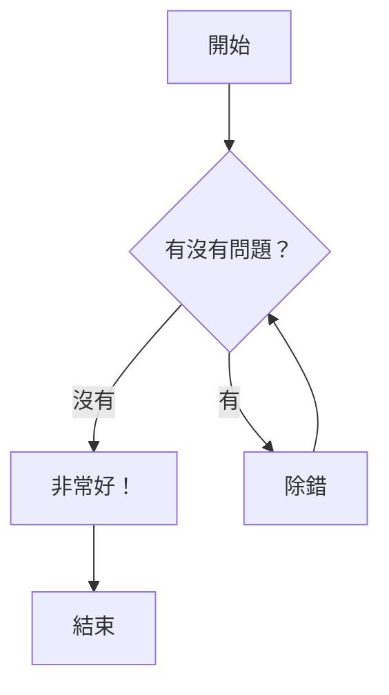
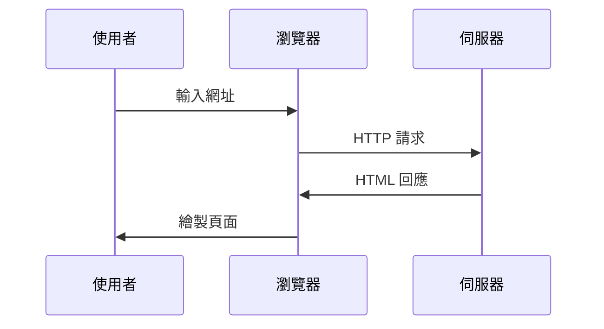
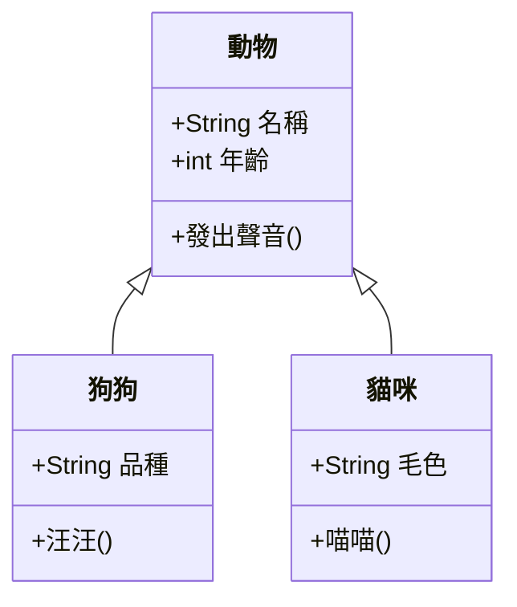

---

title: "範例部落格文章"
description: "所有功能展示。"

---

# 範例部落格文章

這是一篇簡單的示範。

## 1. 文字高亮

可以用 ==高亮文字== 來標示重點，用兩個等號包住即可。

再舉個例子：這句是 ==非常重要== 的資訊！

### 1.1.1 字型變化

- **粗體**
- *斜體*
- ***粗斜體***
- `等寬字型`
- ~~刪除線~~
- x_下標_
- x^上標^
- 鍵盤 <kbd>Ctrl</kbd> + <kbd>C</kbd>

### 1.1.2 代碼區域

#### C

```c
#include <stdio.h>

int main(void) {
    printf("Hello, World!\n");
    return 0;
}
```

#### Python

```python
def hello_world():
    print("Hello, World!")
```

#### Rust

```rust
fn main() {
    println!("Hello, World!");
}
```

## 2. 鍵盤按鍵

複製請按 <kbd>Ctrl</kbd> + <kbd>C</kbd>

Mac 用戶貼上請按 <kbd>⌘</kbd> + <kbd>V</kbd>

## 3. 上標與下標

水的化學式是 H_2_O

愛因斯坦著名方程式：E = mc^2^

更多例子：x^2^ + y^2^ = z^2^ 以及 CO_2_ 排放

## 4. 數學公式（LaTeX）

### Desmos 圖

:::desmos{lang="en" link="https://www.desmos.com/calculator/0fd37b7cad"}
:::

### 行內公式

二次方程求根公式：$x = \frac{-b \pm \sqrt{b^2 - 4ac}}{2a}$

圓面積：$A = \pi r^2$

### 獨立顯示公式

$$
\int_{-\infty}^{\infty} e^{-x^2} \, dx = \sqrt{\pi}
$$

$$
\sum_{n=1}^{\infty} \frac{1}{n^2} = \frac{\pi^2}{6}
$$

$$
a_0 = \frac{1}{L} \int_{-L}^{L} f(x) \, dx
$$

$$
a_n = \frac{1}{L} \int_{-L}^{L} f(x) \cos\left(\frac{n\pi x}{L}\right) dx, \quad n = 1, 2, 3, \ldots
$$

$$
b_n = \frac{1}{L} \int_{-L}^{L} f(x) \sin\left(\frac{n\pi x}{L}\right) dx, \quad n = 1, 2, 3, \ldots
$$

$$
\iiint_R f(x, y, z) \, dx \, dy \, dz = \iiint_S f(x(u,v,w), y(u,v,w), z(u,v,w)) \left| J \right| \, du \, dv \, dw
$$

$$
J = \frac{\partial(x, y, z)}{\partial(u, v, w)} = \begin{vmatrix}
\frac{\partial x}{\partial u} & \frac{\partial x}{\partial v} & \frac{\partial x}{\partial w} \\
\frac{\partial y}{\partial u} & \frac{\partial y}{\partial v} & \frac{\partial y}{\partial w} \\
\frac{\partial z}{\partial u} & \frac{\partial z}{\partial v} & \frac{\partial z}{\partial w}
\end{vmatrix}
$$

$$
\vec{a} \times \vec{b} = \begin{vmatrix}
\vec{i} & \vec{j} & \vec{k} \\
a_1 & a_2 & a_3 \\
b_1 & b_2 & b_3
\end{vmatrix}
$$


## 5. Mermaid 圖表

### 流程圖



### 時序圖



### 類別圖



### 結論

所有功能都正常運作！您現在可以：

- ==高亮== 重要文字
- 顯示快捷鍵，例如 Ctrl + S
- 使用下標（H_2_O）與上標（x^2^）
- 撰寫行內公式 $\alpha + \beta = \gamma$ 以及獨立公式
- 製作美觀的 Mermaid 圖表

---

[返回主頁](/)