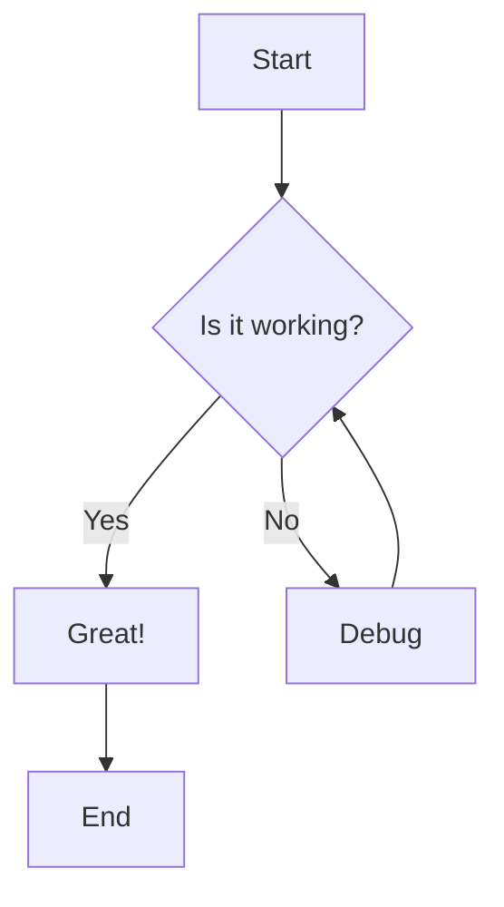
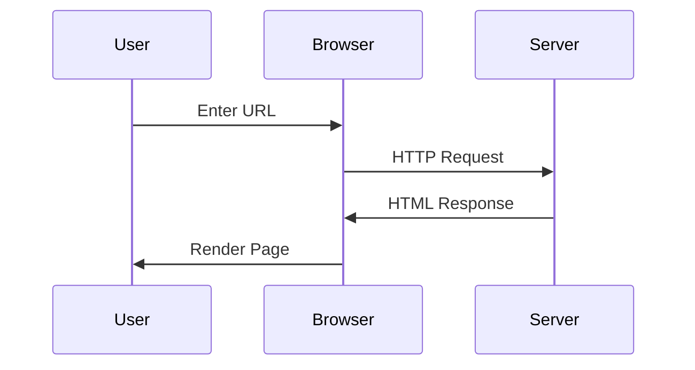
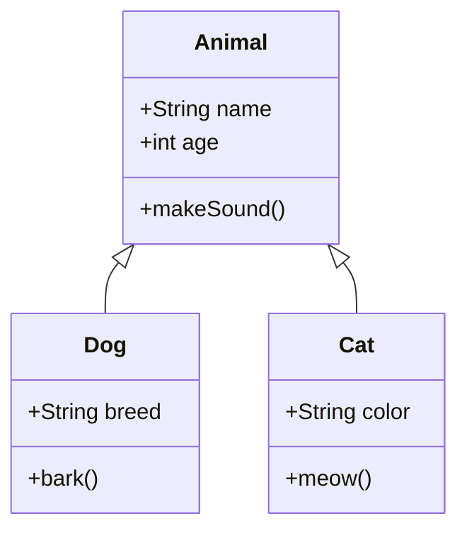

# Sample Blog Post

This is a simple demonstration of all the markdown features.

## 1. Highlighting

You can ==highlight text== using double equals signs.

Here's another example: This is ==very important== information!

### 1.1.1 Font variations

- **Bold**
- *Italic*
- ***Bold Italic***
- `Monospace`
- ~~Strikethrough~~
- x_subscript_
- x^superscript^
- Keyboards <kbd>Ctrl</kbd> + <kbd>C</kbd>

### 1.1.2 Code blocks

#### C

Inline code sample `int x = 0;`.

```c
#include <stdio.h>

int main(void) {
    printf("Hello, World!\n");
    return 0;
}
```

#### Python

```python
def hello_world():
    print("Hello, World!")
```

#### Rust

```rust
fn main() {
    println!("Hello, World!");
}
```

## 2. Keyboard Keys

Press <kbd>Ctrl</kbd> + <kbd>C</kbd> to copy.

Use <kbd>⌘</kbd> + <kbd>V</kbd> to paste on macOS.

## 3. Subscripts and Superscripts

Water's chemical formula is H_2_O.

Einstein's famous equation: E = mc^2^

More examples: x^2^ + y^2^ = z^2^ and CO_2_ emissions.

## 4. Math (LaTeX)

### Inline Math

The quadratic formula is $x = \frac{-b \pm \sqrt{b^2 - 4ac}}{2a}$.

The area of a circle is $A = \pi r^2$.

### Display Math (Block)

$$
\int_{-\infty}^{\infty} e^{-x^2} dx = \sqrt{\pi}
$$

$$
\sum_{n=1}^{\infty} \frac{1}{n^2} = \frac{\pi^2}{6}
$$

$$
a_0 = \frac{1}{L} \int_{-L}^{L} f(x) \, dx
$$

$$
a_n = \frac{1}{L} \int_{-L}^{L} f(x) \cos\left(\frac{n\pi x}{L}\right) dx, \quad n \in \mathbb{N} 
$$

$$
b_n = \frac{1}{L} \int_{-L}^{L} f(x) \sin\left(\frac{n\pi x}{L}\right) dx, \quad n \in \mathbb{N} 
$$

$$
\iiint_R f(x, y, z) \, dx \, dy \, dz = \iiint_S f(x(u,v,w), y(u,v,w), z(u,v,w)) \left|\mathbf{J}\right| \, du \, dv \, dw
$$

$$
\mathbf{J} = \frac{\partial(x, y, z)}{\partial(u, v, w)} = \left[ \begin{matrix}
\frac{\partial x}{\partial u} & \frac{\partial x}{\partial v} & \frac{\partial x}{\partial w} \\
\frac{\partial y}{\partial u} & \frac{\partial y}{\partial v} & \frac{\partial y}{\partial w} \\
\frac{\partial z}{\partial u} & \frac{\partial z}{\partial v} & \frac{\partial z}{\partial w}
\end{matrix}
\right]
$$

$$
\vec{a} \times \vec{b} = \begin{vmatrix}
\vec{i} & \vec{j} & \vec{k} \\
a_1 & a_2 & a_3 \\
b_1 & b_2 & b_3
\end{vmatrix}
$$

## 5. Mermaid Diagrams

### Flowchart



### Sequence Diagram



### Class Diagram



## Conclusion

All features are working! You can now:
- ==Highlight== important text
- Show keyboard shortcuts like <kbd>Ctrl</kbd> + <kbd>S</kbd>
- Write subscripts (H_2_O) and superscripts (x^2^)
- Include inline math $\alpha + \beta = \gamma$ and display math
- Create beautiful Mermaid diagrams

---

[Back to Home](/)
